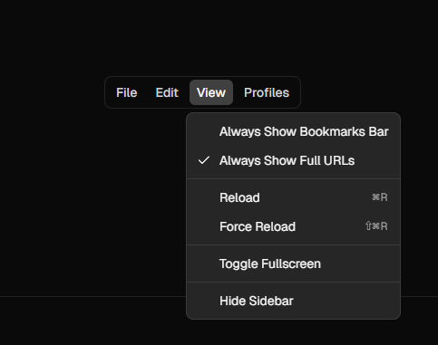

# New Main Page!

TODO:

- move current main page to a backup route.
- Add a floating `menubar` to the top of the main page. Fill with junk data for now.
  - `bun x shadcn-svelte@latest add menubar`
- Add a floating side bar to the main page on the left side of the screen. Fille with junk data for now.
  - `bun x shadcn-svelte@latest add sidebar-02`
- Add a floating `popover`
  - `bun x shadcn-svelte@latest add popover`
- Add a custom context menu
  - `bun x shadcn-svelte@latest add context-menu`

<!-- These might get revisted later -->
<!-- - `bun x shadcn-svelte@latest add sidebar-16` -->
<!-- - `bun x shadcn-svelte@latest add sidebar-13` -->

## New Tool Bar

You are going to change up the toolbar of the application to make it more user-friendly and visually appealing. The new toolbar will have a lower profile and a more modern design. It will consist of a number of floating DaisyUI `menu-horizontal` components. Feel free to fill up the slots with random icons for now, but these will eventually be icons for tools like "pointer", "eraser", "rectangle", "circle", etc.

1. Create a new folder called floating-menus.
2. Inside the `floating-menus` folder, create a new file called `Toolbar.svelte`.
3. In `Toolbar.svelte`, implement something like the reference code example below:

## Reference

Reference Image: 

```svelte
<script lang="ts">
	import * as Menubar from '$lib/components/ui/menubar/index.js';
</script>

<Menubar.Root>
	<Menubar.Menu>
		<Menubar.Trigger>File</Menubar.Trigger>
		<Menubar.Content>
			<Menubar.Item>
				New Tab
				<Menubar.Shortcut>⌘T</Menubar.Shortcut>
			</Menubar.Item>
			<Menubar.Item>New Window</Menubar.Item>
			<Menubar.Separator />
			<Menubar.Item>Share</Menubar.Item>
			<Menubar.Separator />
			<Menubar.Item>Print</Menubar.Item>
		</Menubar.Content>
	</Menubar.Menu>
</Menubar.Root>
```

```svelte
<script lang="ts">
	import * as Popover from '$lib/components/ui/popover/index.js';
</script>

<Popover.Root>
	<Popover.Trigger>Open</Popover.Trigger>
	<Popover.Content>Place content for the popover here.</Popover.Content>
</Popover.Root>
```

```svelte
<script lang="ts">
	import * as ContextMenu from '$lib/components/ui/context-menu/index.js';
</script>

<ContextMenu.Root>
	<ContextMenu.Trigger>Right Click Me</ContextMenu.Trigger>
	<ContextMenu.Content>
		<ContextMenu.Item>Copy</ContextMenu.Item>
		<ContextMenu.Item>Paste</ContextMenu.Item>
		<ContextMenu.Item>Delete</ContextMenu.Item>
	</ContextMenu.Content>
</ContextMenu.Root>
```
